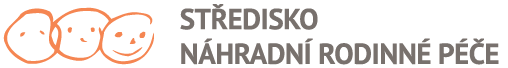
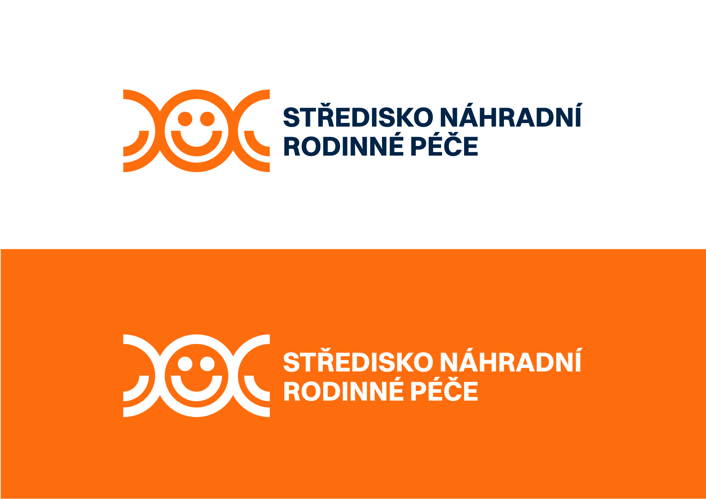

# Full presentation

## LOGO
The current logo of the organization represents three heads, which are supposed to represent a family with a child. The center has been using this logo since the nineties. The typography is gray to brown in color. Together, these colors are very lackluster and unconvincing in my opinion. The organization uses it extensively in its white version, because it is placed on an orange background, which rarely corresponds to its orange variant.

## FONT
Organization uses the this font for its headlines. In my opinion, this font is not suitable for this use, as they are not only targeting children, but also adults who would like to use the services of the organization. It has little contrast, is too narrow and does not capture the recipient's attention. It also cannot be combined well with other fonts, which is why the organization often uses the font for the entire material, which results in poor readability and information hierarchy.

## NEW LOGO
The design of the new logo is based on the organization's original logo. I kept the theme of the heads that management asked me to do. Instead of depicting all three original heads, I focused on the middle one. It represents a smiling child who is surrounded by his parents. It depicts the joy and smile of a child who is the center of a happy family. The full name of the organization is shown in the logo, which is divided into two lines and aligned to the left. The name is made in Switzer font. I created two logo formats for the organization, one left aligned and one centered.

## SYMBOLS
I created a variation of the symbols, from the design of the logo, that I use to create a unified visual style of the organization. The main symbol is the smile symbol, which usually appears on every material of the organisation. I use this symbol of a smile, which represents a smiling and satisfied child, as a basic recognition element of the organisation. It is always located in the lower right or left corner of the material.

## COLORS
For the visual style of the organization, I chose orange, yellow, blue and dark blue. Orange and yellow make up the primary color combination of the organization. The light blue color serves as a complementary color, while the dark blue is the color of all the texts, as the black texts seemed too harsh for the concept, which aims to highlight children's joy. The orange color was requested directly by the management of the organization, as this color has been used since the beginning of the organization. From the point of view of color psychology, orange is suitable for use in the field of non-profit organizations that work with children. It is a warm, positive color. It helps induce joy and drive away sadness or depression.

## TYPOGRAPHY
I chose Switzer font as the main organization font. I also use the font in the logo of the organization. The font has a large variation of eighteen styles, which include italics with a range from Thin to Black. It has Czech diacritics. It is a sans serif font. The font is easy to read and looks modern.
As an additional font, I use the Clash Grotesk font. It impressed me with its playfulness, which is perfect for my design of the visual identity. I mostly use this font for headlines and small headings because it contrasts well with the main Switzer font. It also has Czech diacritics and six styles ranging from Extralight to Bold. The advantage of both selected fonts is that they are available for free, which non-profit organizations will welcome.

## PRINT
Printed materials of all kinds are the most common and popular form of presentation of companies and organizations. The NRP center has not yet used the full potential of these materials. It was essential to determine which materials were suitable for the Center and which were not. I classified the materials into three groups according to what they are intended for and what group of people they should have addressed. The first group is children, then parents and finally the public
